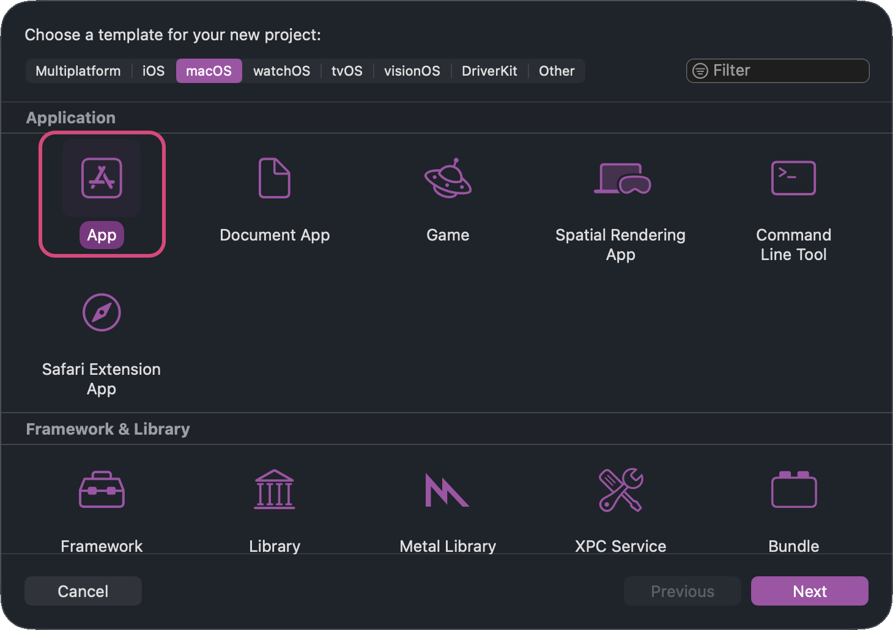
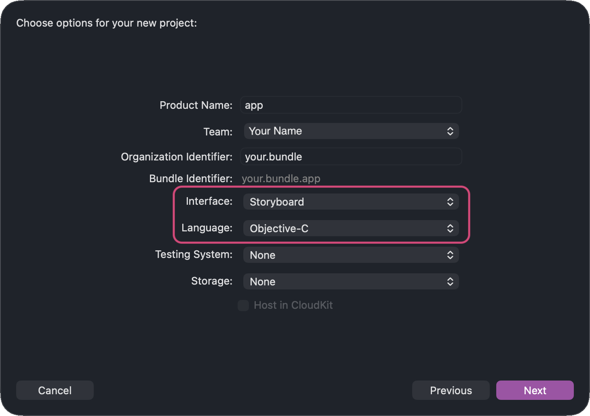
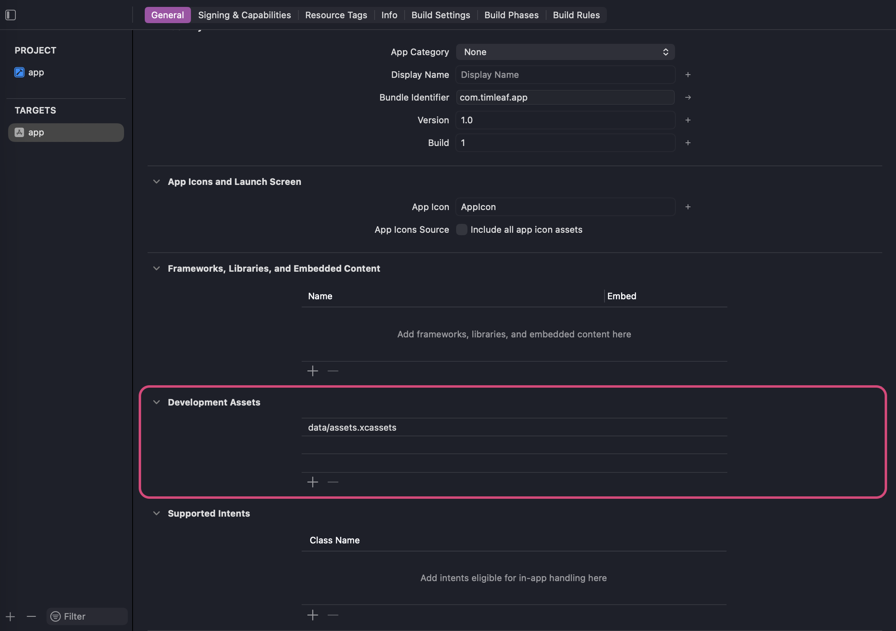
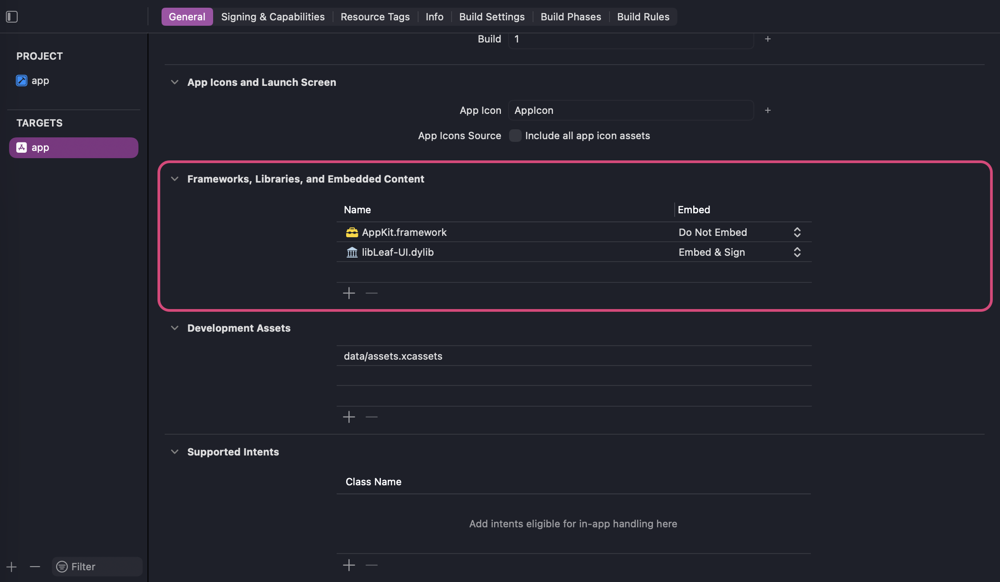
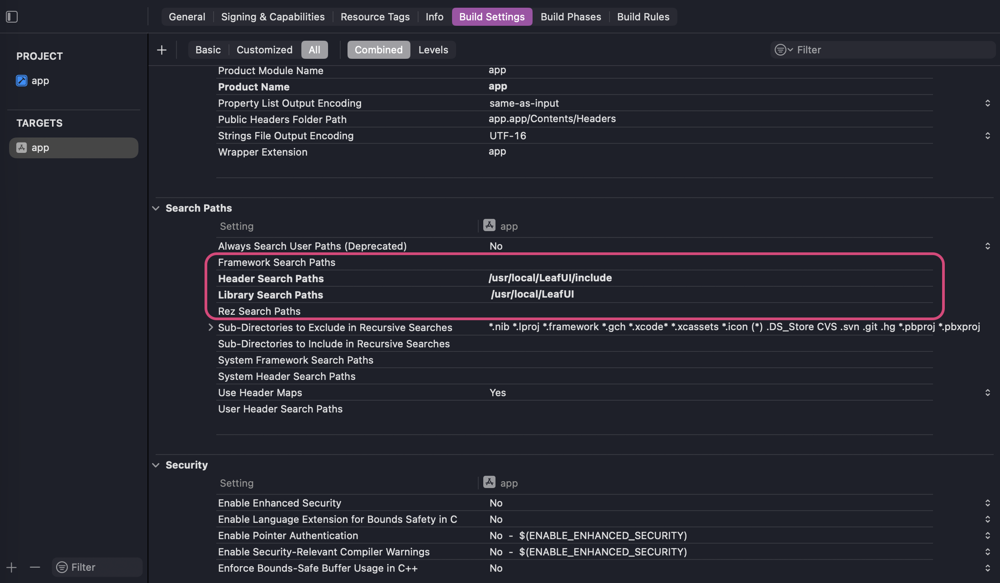
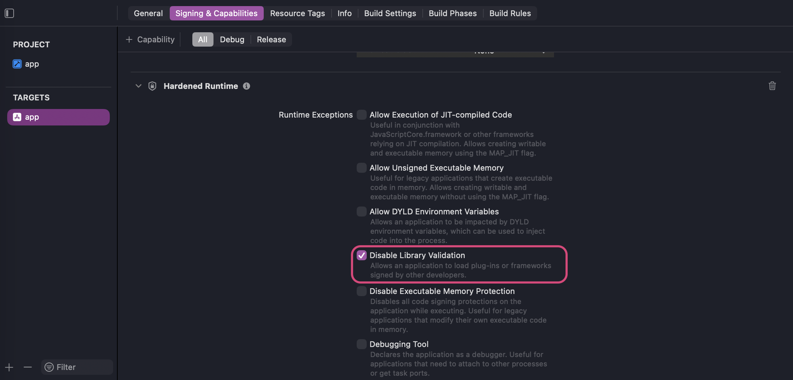

# Leaf-UI

## Description

Leaf-UI was made to allow C++ developers to create native macOS apps without having to handle the Objective-C part of AppKit.

It acts a wrapper for Objective-C classes and objects, so Objective-C syntax can be handled in the background.

For example: 
```objc
// before
NSWindow *main_window = [[NSWindow alloc] 
	initWithContentRect: NSMakeRect(0, 0, 800, 600)
	
	styleMask:	NSWindowStyleMaskClosable  |
				NSWindowStyleMaskTitled
	
	backing: NSBackingStoreBuffered
	
	defer: YES];
	
[main_window setTitle:@"My Application"];
[main_window makeKeyAndOrderFront:nil];
```

```cpp
// after
auto main_window = leaf::window::create(
		// CGrect frame
		CGRect({0, 0, 500, 500}),
		
		// NSWindowStyleMask
		NSWindowStyleMaskClosable | NSWindowStyleMaskTitled,
		
		// NSBackingStoreType (optional), default = buffered
		NSBackingStoreBuffered, 
		
		// defer (optional), default = true
		true
); // -> std::shared_ptr<window>

app->add_window(main_window);

main_window->set_title("Title");
main_window->show();
```


## Quick Start

### 1. Set Up the Xcode Project

This tutorial assumes you use the latest version of Xcode as your IDE.

To use this library, create a new macOS App and select "Storyboard" for the interface, and "Objective-C" for the language (only the main file will need to be Objective-C++, the rest of the codebase can be C++).





You will get the following project: 
```
app.xcodeproj
└── app
	├── AppDelegate.h
	├── AppDelegate.m
	├── Assets.xcassets
	├── Main.storyboard
	├── ViewController.h
	├── ViewController.m
	└── main.m
```

Delete the files: 
- `AppDelegate.h`
- `AppDelegate.m`
- `Main.storyboard`
- `ViewController.h`
- `ViewController.m`

And rename `main.m` (Objective-C) into `main.mm` (Objective-C++) so that the entry point can use both C++ and Objective-C++ syntax.
Reorganize the project however you want now, the only constraint is that you need to keep the `.xcassets` folder, and `main.mm` somewhere.

For example, my project looks like that now: 
```
app.xcodeproj/
│
├── code/
│	├── src/		// .cpp files
│	├── include/	// .hpp files
│	│
│	└── main.mm		// entry point of the application
│
└── data/
	└── assets.xcassets/
```


You can also move and rename "Assets.xcassets", but you will need to drag and drop the file in the following section to reassign it as "Development Asset":


Once that is done, you can replace the content of `main.mm` with:
```cpp
#include <iostream>

int main() {
	std::cout << "Hello, World!" << '\n';
	return 0;
}
```

If the project runs, the setup is done.


### 2. Adding the Library

The first thing to do now is to go in your app project and add both "AppKit.framework" and "libLeaf-UI.dylib" in the "General" > "Frameworks, Libraries, and Embedded Content" section.

Make sure that `AppKit.framework` is not embedded.


Set Header Search Paths to the folder containing Leaf-UI's headers. Set Library Search Paths to the folder containing `libLeafUI.dylib`. Xcode may populate the library search path automatically when the `.dylib` is added, but verify that it points to the correct directory.

You should have something like:


> Note: the library's "Dynamic Library Install Name Base" is set to `@rpath`, so the `.dylib` can be put anywhere on drive.


**⚠ Caution ⚠**
If upon running you encounter an error like:
`'/your/path/libLeaf-UI.dylib' not valid for use in process: mapping process and mapped file (non-platform) have different Team IDs`

You need to check "Disable Library Validation" in your project settings:


At this point your program should run as expected.

### 3. Create Your First App

#### Empty Window

Now that the setup is done, we can create a first crude application.
Replace the content of your `main.mm` with this: 
```cpp
#include <leaf_ui.hpp>

int main() {
	auto app = leaf::application::create();
	auto window = leaf::window::create
		(CGRect({100, 100, 200, 200}), NSWindowStyleMaskTitled);
	
	app->add_window(window);
	window->show();
	
	return app->run();
}
```

If everything is ok, a tiny window should open in the bottom left corner of your screen.
It won't respond to shortcuts like ( ⌘ + Q ) or ( ⌘ + W ), that's normal, you need to initialize menu items to handle this behavior later on.

> Note: you might see warnings in your console like: 
> `-[NSApplication(NSWindowRestoration) restoreWindowWithIdentifier:state:completionHandler:] Unable to find className=(null)`
> 
> or:
> `Unable to obtain a task name port right for pid...`
>
> You can ignore those for now.


#### Responsive Window

Now you can initialize the menu of your app, like so:
```cpp
int main() {
	auto app = leaf::application::create();
	auto window = leaf::window::create(CGRect({100, 100, 200, 200}),
	                                   NSWindowStyleMaskTitled);
	
	app->add_window(window);
	window->show();
	
	// ------ menu config ------
	
	auto app_menu = leaf::menu::create("App");
	
	// Quit App
	auto quit_item = leaf::menu_item::create(
		"Quit App", [&] { app->quit(); });
	
	quit_item->set_shortcut(
	    leaf::shortcut(leaf::modifier_flag::command, "q")); // = ⌘Q
	
	// Close Active Window
	auto close_window_item = leaf::menu_item::create(
	    "Close Window", [&] { app->close_active_window(); });
	    
	close_window_item->set_shortcut(
	    leaf::shortcut(leaf::modifier_flag::command, "w")); // = ⌘W
	
	app_menu->add_menu_item(quit_item);
	app_menu->add_menu_item(close_window_item);
	
	// ------ menu config ------
	
	app->add_menu(app_menu);
	return app->run();
}
```

Now your application should close when using the default shortcuts ⌘Q and ⌘W. The shortcuts can be set to pretty much anything.


#### Your First Widget

At this point, if the code compiles and runs correctly, and the window is responsive to the defined keyboard shortcuts, it's time to add widgets.

To add a simple label with a button, use the following code:
```cpp
int main() {
	auto app = leaf::application::create();
	auto window = leaf::window::create(CGRect({100, 100, 200, 200}),
			                            NSWindowStyleMaskTitled);
	
	app->add_window(window);
	window->show();
	
	// menu config
	
	auto app_menu = leaf::menu::create("App");
	
	// Quit App
	auto quit_item = leaf::menu_item::create("Quit App", [&] { app->quit(); });
	
	quit_item->set_shortcut(
	    leaf::shortcut(leaf::modifier_flag::command, "q")); // = ⌘Q
	
	// Close Active Window
	auto close_window_item = leaf::menu_item::create(
	    "Close Window", [&] { app->close_active_window(); });
	
	close_window_item->set_shortcut(
	    leaf::shortcut(leaf::modifier_flag::command, "w")); // = ⌘W
	
	app_menu->add_menu_item(quit_item);
	app_menu->add_menu_item(close_window_item);
	
	// menu config
	
	
	// widgets config
	
	auto label = leaf::label::create("Hello, World!", CGRect{50, 80, 100, 20});
	window->add_view(label);
	
	auto button = leaf::button::create(CGRect{80, 20, 80, 20});
	button->set_title("Press Me");
	button->set_action([&label] { label->set_text("Button Pressed"); });
	window->add_view(button);
	
	// widgets config
	
	app->add_menu(app_menu);
	return app->run();
}
```

Now you have a crude application with widgets interacting in real time.


### Congratulations

🎉 You just made your first AppKit application through C++ 🎉

From here, you can use the available Leaf-UI classes to build your interface. See the next section, **Classes Handled**, for the currently supported AppKit objects.


## Classes Handled

### Application & Window

- [x] `NSApplication`
- [x] `NSApplicationDelegate`
- [x] `NSWindow`
- [x] `NSWindowDelegate`

### Objects

- [x] `NSImage`
- [x] `NSData`
- [x] `NSTimer`

## Menus

- [x] `NSMenu`
- [x] `NSMenuItem`

### Views

- [x] `NSView`
- [x] `NSImageView`
- [x] `NSStackView`
- [x] `NSPopUpButton`
- [x] `NSSegmentedControl`
- [x] `NSButton`
- [x] `NSSlider`
- [x] `NSTextField` 


## Specificities

---
### Native Exposure

The goal of Leaf-UI is not to replace AppKit and abstract every single behavior possible. Rather it aims at giving programmers a C++ wrapper that's easier to use for some than Objective-C. 

However, Objective-C behaviors are not locked, and the native objects can be accessed from their wrapper freely, like so:
```objc
auto some_slider = leaf::slider::create();

some_slider->set_min_value(0.0);
some_slider->set_max_value(100.0);

[some_slider->get_native() setSliderType:NSSliderTypeCircular];
```

Here the `NSSliderType` can be modified through either the C++ or Objective-C method, both calls are equally valid as the wrapper would do the same call under the hood.

This is particularly useful for behaviors that are not yet supported by Leaf-UI.


---
### Ownership

Leaf-UI constructors are protected, so objects are created through their create() factory functions. The factories return either std::shared_ptr or std::unique_ptr depending on the ownership model of the object.

This prevents the user from accidentally creating unmanaged instances of Leaf-UI objects.

For example: 
```cpp
auto app = leaf::application::create(); // unique_ptr

// ...

bool x = true;
auto toggle_x = leaf::checkbox::create(x);
```


---
### Callbacks

Leaf-UI provides a C++ callback interface over AppKit's Objective-C target/action mechanism.

For example:
```objc
// before
- (void)invoke:(id)sender{ NSLog(@"HELLO TEST"); }

NSMenuItem *item = [[NSMenuItem alloc]
						initWithTitle:@"Test Item"
						action:@selector(invoke:)
						keyEquivalent:@""];

[item setTarget:self];
```

```cpp
// after
std::unique_ptr<menu_item> item = 
leaf::menu_item::create(
	"Test Item",
	[] { /* do something */ }
);
```

To use a callback in a class, all you need is to add 2 members to a class derived from `object`, like so:
```objc
class new_object : public object {
	public:
		void set_action(std::function<void()> new_action) {
			// overrides the default ([]() {}) action
			// set_action is optional if the default 
			// behavior is enough by itself
			_callback->set_action(new_action); 
		}
	
	private:
		void init_callback() {
			
			// creates the callback responsible for calling
			// the function defined below
			_callback = leaf::callback::create([] {
				// default behavior
			});
			
			// creates a callback target for NSObject*
			_target = [[leaf_callback_target alloc]
				initWithCallback:_callback.get()];
			
			// assigns the target to NSObject* 
			[get_native() setTarget:_target];
			
			// assigns the `callback::invoke()` method
			// to NSObject*. `callback::invoke()`'s  job 
			// is to call callback's action, overriden above
			[get_native() setAction:@selector(invoke:)];
		}
		
		std::unique_ptr<callback> _callback;
		leaf_callback_target *_target;
}
```

So, in order: 
- `_callback` is created with a lambda function which it stores.
- `_target` is created and stores `callback*` .

- `_target` is assigned as the `NSObject`'s target.
- `leaf_target_callback::invoke(id sender)` is added as the action of `NSObject*` 

- `invoke(id sender)` calls `_callback::invoke()` which calls `_callback.action`, whatever it is.

- Then upon "activation", the widget calls `leaf_target_callback::invoke(id sender)`. "activation" can mean different things depending on the widget. For a `button` it's clicking, for a `text_field` it's pressing Return ( ⏎ ), ...

#### Activation per Widget

| Widget      | Activation          |
| ----------- | ------------------- |
| menu_item   | menu item selection |
| button      | mouse click         |
| text_field  | enter/return ( ⏎ )  |
| slider      | value change        |


---
### AppDelegate

In order to be able to customize the applications, an app_delegate class was created to replace Objective-C's object inheriting `NSObject` and acting as a delegate. 

In order to do so, the `application_delegate` class was given default hooks, like:
```cpp
std::function<bool()> should_terminate_after_last_window_closed = 
[]{ 
	return true; 
};
```

or:
```cpp
std::function<void()> on_quit = []{};
```


These function are then called from within an Objective-C app delegate object.
More importantly, they can be overriden thanks to the `application` class.

For example, to ask for the app to quit once all windows are closed, in Objective-C you would do:
```objc
@interface leaf_app_delegate : NSObject<NSApplicationDelegate>

@property(nonatomic, assign) leaf::app_delegate *owner;
- (void)setOwner:(leaf::app_delegate *)owner;

- (void)applicationWillTerminate:(NSNotification *)notification;

@end

@implementation

- (void)applicationWillTerminate:(NSNotification *)notification {
	if(_owner)
		_owner->on_quit();
}


@end
```

But in C++, you can now do:
```cpp
application app{};

app.on_quit(
	[&]() -> void { 
		some_object.destroy();
		delete some_ptr;
		os_log_info(logs::main, "Application is quitting\n");
	}
);
```

Upon an `NSApplication` closing, `applicationWillTerminate:` is automatically called. `app_delegate` simply sets the behavior of the method.


---
### WindowDelegate

To be able to react to windows' events, a `leaf_window_delegate` was built as follows: 
```objc
@interface leaf_window_delegate : NSObject<NSWindowDelegate>

@property(nonatomic, assign) leaf::window *owner;

-(void)windowWillClose:(NSNotification *)notification;

@end
```

And the window class was modified. First, it was given a pointer to track its owner (`leaf::application`), and a `application::remove_window(window*)` method was exposed to the API. A `leaf::window::on_close` method that is called from within the `leaf_window_delegate::windowWillClose` was also created.

In the end: 
- When the `menu_item` "Close Window" ( ⌘ + W ) is called, it calls `[_native_window close]`.
- The window closing calls the `leaf_window_delegate::windowWillClose`, which in its turn calls `_owner_window->on_close()`
- `_owner_window->on_close()` calls `_owner_application->remove_window(this)`.

That way the `leaf::application` vector containing the windows doesn't retain the closed `NSWindow`s, and erasing their `std::unique_ptr`s destroys the corresponding `leaf::window` wrappers.


---
### Menu Bar

In Objective-C's AppKit, the menus work with 2 objects:
- `NSMenu`
- `NSMenuItem`

I decided to go in a different direction, and implement three objects:
- `menu_bar`
- `menu`
- `menu_item`

This way the hierarchy is as follows: `menu_bar` owns all `menu` objects. Each menu object owns its `menu_item` objects. This lets `menu_bar` act as a container for the `menu`s and `menu_item`s with its own methods to handle them such as `menu_bar::add_menu`.

This also dissipates the confusion of having several of the same `menu` objects acting respectively as a menu bar and sub-menus.

Menus Hierarchy Tree Example:
```
Menu Bar
│
├── File 		// Menu
│	├── New		// Menu Item
│	├── Open		
│	└── Quit
│
└── Edit
	├── Copy
	└── Paste
```


---
### Image View Rendering

In order to choose the interpolation style of the `image`s rendered through `image_view`, create an Objective-C class `leaf_image_cell` like so:
```objc
@interface leaf_image_cell : NSImageCell {
	NSImageInterpolation _interpolation;
} 

-(void)setInterpolation:(NSImageInterpolation)interpolation;
@end
```

And inside the `leaf_image_cell` I override the `drawWithFrame` method, as follows: 
```objc
- (void)drawWithFrame:(NSRect)cellFrame inView:(NSView *)controlView {
	NSGraphicsContext *current = [NSGraphicsContext currentContext];
	
	NSImageInterpolation previous = current.imageInterpolation;
	current.imageInterpolation = _interpolation;
	
	[super drawWithFrame:cellFrame inView:controlView];
	
	current.imageInterpolation = previous;
}
```

Without that, it's impossible to set the correct value to `imageInterpolation` in time for it to render our image with the correct interpolation mode. 


## Project Tree

```
Leaf-UI
│
├── leaf_ui.hpp 			// entry point of the library
│
├── include/
│	├── callback/
│	│	└── callback.hpp
│	│
│	├── helpers/
│	│	└── shortcut.hpp
│	│
│	├── menu/
│	│	├── menu.hpp
│	│	├── menu_bar.hpp
│	│	└── menu_item.hpp
│	│
│	├── object/
│	│	├── data.hpp
│	│	├── image.hpp
│	│	└── timer.hpp
│	│
│	├── view/
│	│	├── button.hpp
│	│	├── checkbox.hpp
│	│	├── image_view.hpp
│	│	├── label.hpp
│	│	├── popup.hpp
│	│	├── segmented_control.hpp
│	│	├── shared_view.hpp
│	│	├── slider.hpp
│	│	├── stack_view.hpp
│	│	├── text_field.hpp
│	│	└── view.hpp
│	│
│	├── app_delegate.hpp
│	├── application.hpp
│	├── object.hpp
│	├── window.hpp
│	└── window_delegate.hpp
│
└── src/
	├── callback/
	│	└── callback.mm
	│
	├── menu/
	│	├── menu.mm
	│	├── menu_bar.mm
	│	└── menu_item.mm
	│
	├── object/
	│	├── data.mm
	│	├── image.mm
	│	└── timer.mm
	│
	├── view/
	│	├── button.mm
	│	├── checkbox.mm
	│	├── image_view.mm
	│	├── label.mm
	│	├── popup.mm
	│	├── segmented_control.mm
	│	├── shared_view.mm
	│	├── slider.mm
	│	├── stack_view.mm
	│	├── text_field.mm
	│	└── view.mm
	│
	├── app_delegate.mm
	├── application.mm
	├── object.mm
	├── window.mm
	└── window_delegate.mm
```
